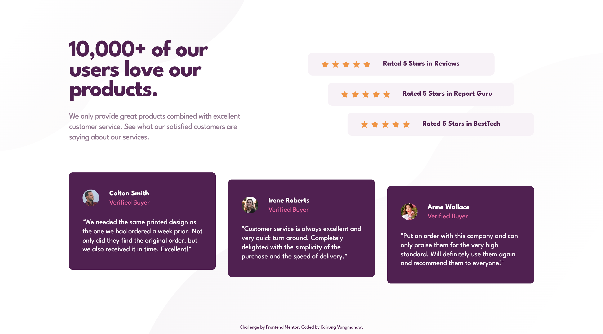

# Frontend Mentor - Social proof section solution


This is a solution to the [Social proof section challenge on Frontend Mentor](https://www.frontendmentor.io/challenges/social-proof-section-6e0qTv_bA). Frontend Mentor challenges help you improve your coding skills by building realistic projects. 

## Table of contents

- [Frontend Mentor - Social proof section solution](#frontend-mentor---social-proof-section-solution)
  - [Table of contents](#table-of-contents)
  - [Overview](#overview)
    - [The challenge](#the-challenge)
    - [Screenshot](#screenshot)
    - [Links](#links)
  - [My process](#my-process)
    - [Built with](#built-with)
    - [What I learned](#what-i-learned)
    - [Continued development](#continued-development)
    - [Useful resources](#useful-resources)
    - [AI Collaboration](#ai-collaboration)
  - [Author](#author)
  - [Acknowledgments](#acknowledgments)

## Overview

### The challenge

Users should be able to:

- View the optimal layout for the section depending on their device's screen size

### Screenshot

<details>
  <summary>Mobile view</summary>
  
</details>

<details>
  <summary>Desktop view</summary>
  
</details>

### Links

- Solution URL: [Responsive Social Proof Section built with React, Vite & BEM](https://www.frontendmentor.io/solutions/responsive-social-proof-section-page-with-react-and-sass-_OgQ1_ngxG)
- Live Site URL: [Frontend Mentor | Social proof section](https://challenged-by-frontend-mentor.github.io/social-proof-section/)

## My process

### Built with

- Semantic HTML5 markup
- CSS custom properties
- Flexbox
- CSS Grid
- Mobile-first workflow
- [React](https://reactjs.org/) - JS library
- [Vite](https://vitejs.dev/) - Frontend tooling
- [BEM Methodology](https://getbem.com/) - Class naming convention for maintainable CSS

### What I learned

Working on this project helped me build a faster, more organized development workflow while maintaining clean React code and structured BEM CSS.

Key takeaways from this challenge:

- **Staggered Layout Alignment**: I learned how to combine CSS Grid row definitions with Flexbox `align-self` positioning (`flex-start`, `center`, `flex-end`) on `:nth-child` selectors to create the staggered "staircase" effect for cards on desktop.

- **Content Fluidity & Responsiveness**: Using `min-height` instead of fixed heights prevents layout breaks and text overflow when font size scales or zoom levels change.

- **Accessible Component Design**: I practiced hiding decorative visual elements like star icons from screen readers using `aria-hidden="true"` while maintaining semantic structure with `blockquote` and `p` tags.

```js
// Dynamically rendering star icons using Array.from() inside JSX
const Stars = () => {
  return (
    <div className="rating-card__stars" aria-hidden="true">
      {Array.from({ length: 5 }).map((_, index) => (
        
      ))}
    </div>
  );
};
```

```css
/* Staggering card positions cleanly with CSS */
@media (min-width: 1024px) {
  .rating-card:nth-child(1),
  .review-card:nth-child(1) {
    align-self: flex-start;
  }
  .rating-card:nth-child(2),
  .review-card:nth-child(2) {
    align-self: center;
  }
  .rating-card:nth-child(3),
  .review-card:nth-child(3) {
    align-self: flex-end;
  }
}
```

### Continued development

In upcoming projects, I want to keep refining my core CSS skills and development practices:

- **Fluid Design Techniques**: Exploring `clamp()` and dynamic viewport units to handle layout and font scaling without relying on fixed pixel breakpoints.

- **Semantic & Naming Precision**: Continuing to practice finding the most natural, idiomatic BEM names and semantic HTML elements.

- **Micro-interactions**: Adding subtle CSS transitions and hover states to enhance overall user experience.

### Useful resources

- [Looping inside JSX - Stack Overflow](https://stackoverflow.com/questions/47287177/how-to-loop-over-a-number-in-react-inside-jsx) - This thread helped me cleanly loop through a fixed number in JSX using `Array.from()` to render star icons without unnecessary boilerplate.

### AI Collaboration

- **Tools Used**: Gemini and Google Search AI Mode.

- **Workflow & Support**: Used as an active thought partner for code reviews, checking accessibility best practices, validating CSS Grid behaviors, and refining BEM class architecture.

## Author

- GitHub: [Kairung Vangmanaw](https://github.com/VangmanawKairung)
- Frontend Mentor - [@VangmanawKairung](https://www.frontendmentor.io/profile/VangmanawKairung)

## Acknowledgments

- **To Myself & Family**: Proud of staying consistent, working smarter, and pushing my coding skills further every day—and deeply grateful to my family for their constant support.

- **Frontend Mentor**: Thank you to the Frontend Mentor team for providing realistic, beautifully designed challenges that make learning fun.

- **Tools & Utilities**: A special shoutout to the built-in **macOS Preview app—using** it to inspect precise pixel coordinates directly saved a lot of trial-and-error time! Thanks as well to VS Code, Chrome DevTools, and AI tools for making the development process smooth and enjoyable.
